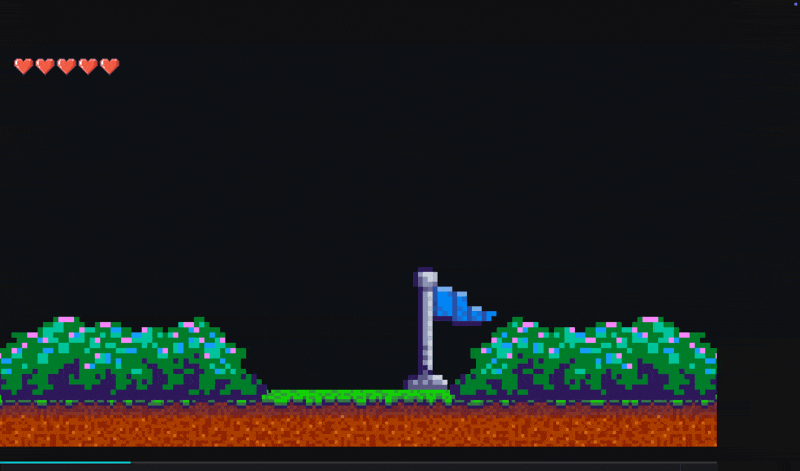

<div align="center">

<!-- HEADER GIF -->


<!-- TYPING SVG -->
<a href="https://git.io/typing-svg">
  
</a>

<br/>

<!-- PROFILE BADGES -->
<a href="https://github.com/sphinx78?tab=followers">
  
</a>
&nbsp;

&nbsp;
<a href="https://instagram.com/kayastha_78">
  
</a>
&nbsp;


</div>

<br/>

<!-- ═══════════════════════════════════════════════════════════════════ -->
<!-- CODE EDITOR BLOCK -->
<!-- ═══════════════════════════════════════════════════════════════════ -->

<div align="center">
<table>
<tr>
<td>

```python
#!/usr/bin/env python3
# -*- coding: utf-8 -*-
"""
╔══════════════════════════════════════════════════════╗
║  sphinx78.py — who am I?                             ║
║  Last compiled: 2026                                 ║
╚══════════════════════════════════════════════════════╝
"""

class Sphinx78:
    def __init__(self):
        self.name       = "Shubham Kayastha"
        self.handle     = "@sphinx78"
        self.location   = "📍 Kathmandu, Nepal"
        self.education  = "🎓 Computer Science Student"
        self.role       = "Full-Stack Developer & ML Enthusiast"

        self.languages  = ["Python", "JavaScript", "Java",
                           "PHP", "TypeScript", "SQL"]

        self.frameworks = ["Node.js", "React", "NumPy",
                           "Jupyter", "Chrome Extensions"]

        self.interests  = ["🤖 Machine Learning",
                           "🌐 Web Development",
                           "📊 Stock Market Analysis",
                           "🧠 Neural Networks",
                           "🔧 Browser Extensions"]

        self.current    = {
            "🔭 Working on": "Neural Networks from Scratch",
            "🌱 Learning":   "Deep Learning & AI",
            "💬 Ask me":     "Python, JS, or Browser Extensions",
            "⚡ Fun fact":   "I debug with print statements 🤫",
        }

    def say_hi(self):
        print("Thanks for dropping by! Let's build something cool 🚀")


# ── Instantiate & run ──────────────────────────────────
me = Sphinx78()
me.say_hi()
```

</td>
</tr>
</table>
</div>

<br/>

<!-- ═══════════════════════════════════════════════════════════════════ -->
<!-- ABOUT ME SECTION -->
<!-- ═══════════════════════════════════════════════════════════════════ -->

<div align="center">

##  &nbsp;About Me

</div>


- 🔭 Currently working on **[NN](https://github.com/sphinx78/NN)** — Building Neural Networks from scratch with NumPy
- 🌐 Built **[NET-Trans](https://github.com/sphinx78/NET-trans)** — A browser extension bridging English, Nepali & Tamang
- 📊 Created **[Sharemarket-Prediction](https://github.com/sphinx78/Sharemarket-Prediction)** — ML-powered stock prediction
- 🛠️ Developed **[SiteTracker](https://github.com/sphinx78/sitetracker)** — Chrome extension for site tracking
- ☕ Developed **[Payments](https://github.com/sphinx78/payments)** — Java web app for group payment management
- 🎓 CS Student passionate about **AI, Web Dev & Open Source**
- ⚡ Fun fact: My code works on the first try... said no one ever 😄

<br clear="both"/>

---

<!-- ═══════════════════════════════════════════════════════════════════ -->
<!-- TECH STACK -->
<!-- ═══════════════════════════════════════════════════════════════════ -->

<div align="center">

## 🛠️ Tech Stack & Tools

<!-- LANGUAGES -->
<h3>💻 Languages</h3>

<a href="#">
  
</a>

<h3>🧰 Frameworks & Libraries</h3>

<a href="#">
  
</a>

<h3>⚙️ Tools & Platforms</h3>

<a href="#">
  
</a>

</div>

---

<!-- ═══════════════════════════════════════════════════════════════════ -->
<!-- GITHUB STATS -->
<!-- ═══════════════════════════════════════════════════════════════════ -->

<div align="center">

##  GitHub Stats

<br/>

<!-- STATS CARDS ROW -->
<a href="https://github.com/sphinx78">
  
</a>
<a href="https://github.com/sphinx78">
  
</a>

<br/><br/>

<!-- STREAK STATS -->
<a href="https://github.com/sphinx78">
  
</a>

<br/><br/>

<!-- ACTIVITY GRAPH -->
<a href="https://github.com/sphinx78">
  
</a>

</div>

---

<!-- ═══════════════════════════════════════════════════════════════════ -->
<!-- FEATURED PROJECTS -->
<!-- ═══════════════════════════════════════════════════════════════════ -->

<div align="center">

## 🏆 Featured Projects

<br/>

<a href="https://github.com/sphinx78/NN">
  
</a>
<a href="https://github.com/sphinx78/NET-trans">
  
</a>

<br/><br/>

<a href="https://github.com/sphinx78/Sharemarket-Prediction">
  
</a>
<a href="https://github.com/sphinx78/payments">
  
</a>

<br/><br/>

<a href="https://github.com/sphinx78/sitetracker">
  
</a>
<a href="https://github.com/sphinx78/Class-absent-record">
  
</a>

</div>

---

<!-- ═══════════════════════════════════════════════════════════════════ -->
<!-- CONTRIBUTION SNAKE -->
<!-- ═══════════════════════════════════════════════════════════════════ -->

<div align="center">

## 🐍 Contribution Snake

<picture>
  <source media="(prefers-color-scheme: dark)" srcset="https://raw.githubusercontent.com/sphinx78/sphinx78/output/github-snake-dark.svg" />
  <source media="(prefers-color-scheme: light)" srcset="https://raw.githubusercontent.com/sphinx78/sphinx78/output/github-snake.svg" />
  
</picture>

</div>

---

<!-- ═══════════════════════════════════════════════════════════════════ -->
<!-- TROPHY SECTION -->
<!-- ═══════════════════════════════════════════════════════════════════ -->

<div align="center">

## 🏅 GitHub Trophies

<br/>

<a href="https://github.com/sphinx78">
  
</a>

</div>

---

<!-- ═══════════════════════════════════════════════════════════════════ -->
<!-- SPOTIFY / QUOTE -->
<!-- ═══════════════════════════════════════════════════════════════════ -->

<div align="center">

## 💭 Random Dev Quote

<br/>

<a href="https://github.com/sphinx78">
  
</a>

</div>

---

<!-- ═══════════════════════════════════════════════════════════════════ -->
<!-- CONNECT SECTION -->
<!-- ═══════════════════════════════════════════════════════════════════ -->

<div align="center">

## 🤝 Let's Connect!

<br/>

<a href="https://github.com/sphinx78">
  
</a>
&nbsp;
<a href="https://instagram.com/kayastha_78">
  
</a>

<br/><br/>

<!-- TYPING SVG FOOTER -->
<a href="https://git.io/typing-svg">
  
</a>

<br/><br/>

<!-- WAVE SVG -->


</div>

<!-- ═══════════════════════════════════════════════════════════════════ -->
<!-- SECRET: If you're reading this, you're awesome 🤘 -->
<!-- ═══════════════════════════════════════════════════════════════════ -->
